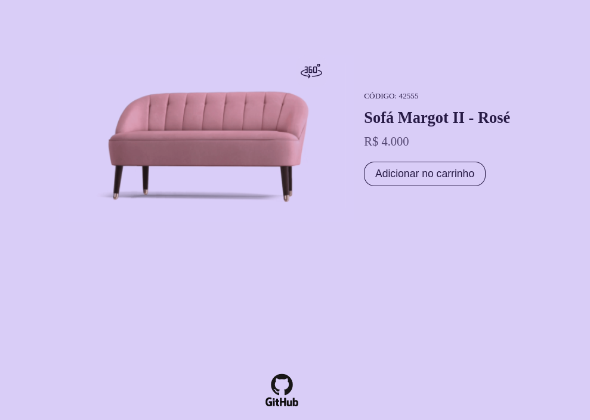

<h1 align="center"> Bora Codar - Card Produto </h1>

Segundo projeto dos desafios semanais, o #boracodar é um espaço para mostrar nossas habilidades na programação.   
<a href="https://boracodar.dev">Acesse a plataforma Bora Codar.</a>

  <a href="#-tecnologias">Tecnologias</a>&nbsp;&nbsp;&nbsp;|&nbsp;&nbsp;&nbsp;
  <a href="#-projeto">Projeto</a>&nbsp;&nbsp;&nbsp;|&nbsp;&nbsp;&nbsp;
  <a href="#-layout">Layout</a>&nbsp;&nbsp;&nbsp;|&nbsp;&nbsp;&nbsp;
  <a href="#memo-licença">Licença</a>

 

  

## 🚀 Tecnologias

Esse projeto foi desenvolvido com as seguintes tecnologias:

- HTML
- CSS
- JavaScript
- Git e Github
- Figma

## 💻 Projeto

Sempre na quarta-feira, às 11h, vai ser liberado um novo desafio no site boracodar.dev.

- [Acesse o projeto finalizado, online](https://thilourenco.github.io/challenge-bora-codar/02-product-card/)

## 🔖 Layout

Você pode visualizar o layout do projeto através do [link](<https://www.figma.com/file/PGD234yNkplbLm5IhMsl01/%23boraCodar---Desafio-2-(Community)?node-id=0%3A1&t=MLAdOT70ovkGb5VD-0>). É necessário ter conta no [Figma](https://figma.com) para acessá-lo.

## :memo: Licença

Esse projeto está sob a licença MIT.